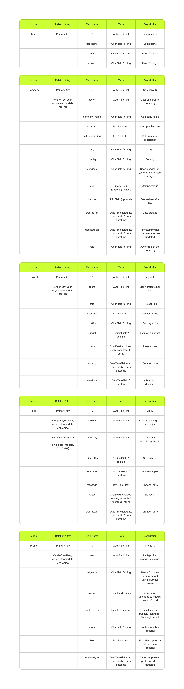
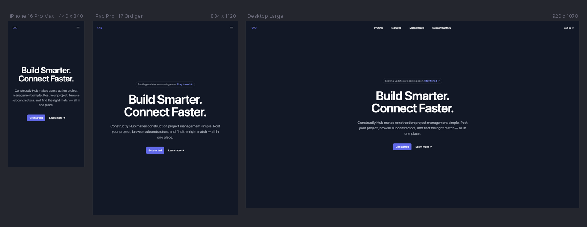
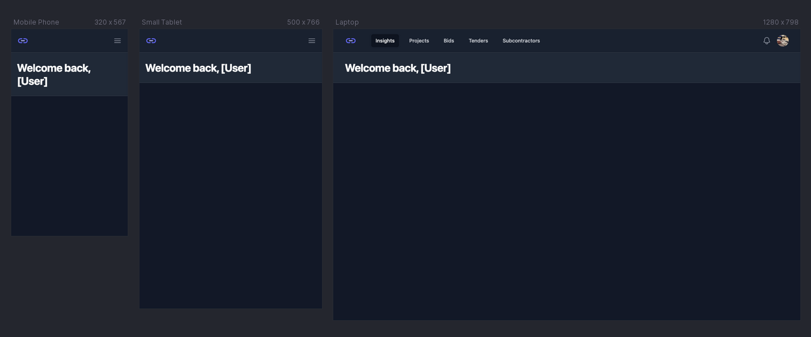
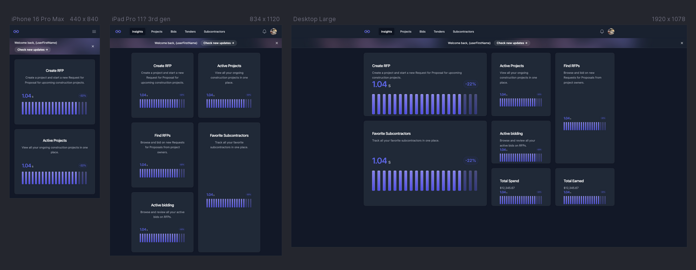
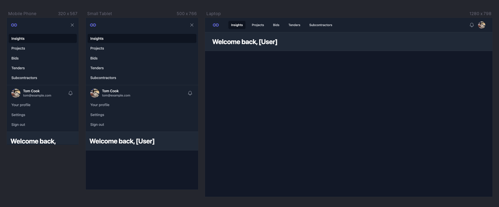
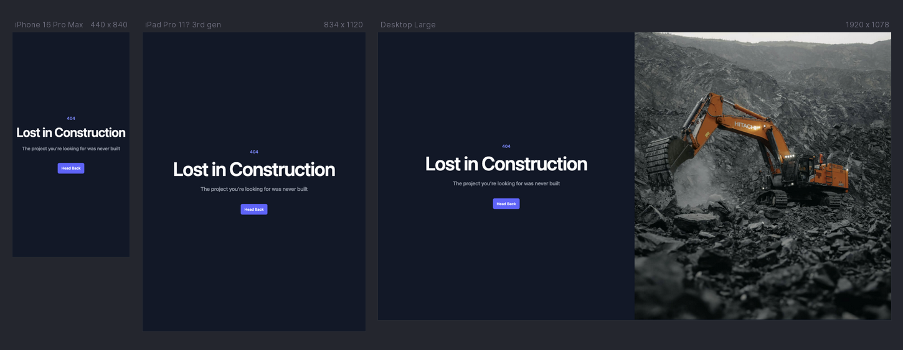
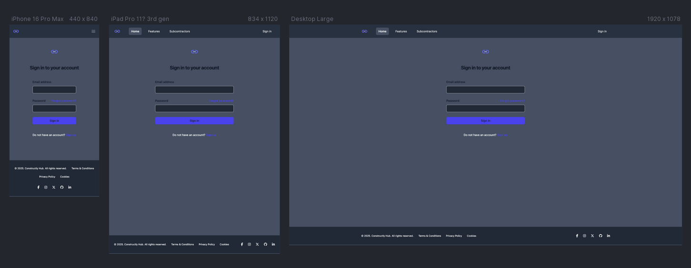

# Constructly Hub — A better way of Construction

Constructly Hub is a modern marketplace platform designed to simplify construction project management. Clients can post project requests, browse available subcontractors, and compare offers, while subcontractors can create profiles, showcase their expertise, and apply for relevant projects. The platform streamlines the entire process, making it easier for both sides to connect and collaborate effectively.

🔗 [**Live site**]()

---

## Contents

- [User Experience (UX)](#user-experience-ux)
  - [Business Goals](#business-goals)
  - [User Stories](#user-stories)
- [Design](#design)
  - [Color Scheme](#color-scheme)
  - [Typography](#typography)
  - [Imagery](#imagery)
  - [Wireframes](#wireframes)
- [Features](#features)
  - [Common to All Pages](#common-to-all-pages)
  - [Page-Specific Features](#page-specific-features)
  - [Future Implementations](#future-implementations)
  - [Accessibility Considerations](#accessibility-considerations)
- [Technologies Used](#technologies-used)
  - [Languages Used](#languages-used)
  - [Frameworks, Libraries & Programs Used](#frameworks-libraries--programs-used)
- [Deployment](#deployment)
- [Local Development](#local-development)
- [Testing](#testing)
- [Credits](#credits)
  - [Code Used](#code-used)
  - [Content](#content)
  - [Media](#media)
  - [Acknowledgments](#acknowledgments)

---

## User Experience (UX)

### Business Goals

### User Stories

## Design

### Color Scheme

### Typography

### Imagery

### Wireframes
<!-- Change flowchart before final version -->

See in PDF format **[Sitemap and User Flow Manifest](documentation/flowcharts/logic/constructly-hub.pdf)**

<!-- Add more models if completed more stories than MVP and move flowchart and ERD into dedicated section -->

<!-- Hero page -->

<!-- Main app layout -->

<!-- Insights -->

<!-- Main app dropdown -->

<!-- 404 Page -->

<!-- Sign In -->

---

## Features

### Common to All Pages

### Page-Specific Features

<!-- **404 Page** -->
<!-- **401 Page** -->
<!-- **503 Page** -->

### Future Implementations

### Accessibility Considerations

<!-- - Semantic HTML: Meaningful HTML tags are used to ensure proper document structure for assistive technologies. -->
<!-- - Descriptive Alt Attributes: All images include descriptive alt attributes for screen reader users. -->
<!-- - Radio buttons are wrapped in fieldset with legend name. -->
<!-- - Color Contrast: Colors were selected to ensure sufficient contrast for readability. -->

---

## Technologies Used

### Languages Used

- **HTML**
- **CSS**
- **JavaScript**

### Frameworks, Libraries & Programs Used

- **[Git & GitHub](https://github.com/)** – Version control and hosting.
<!-- - **[Google Fonts](https://fonts.google.com/)** – Typography. -->
- **[Google DevTools](https://developer.chrome.com/docs/devtools/)** – Development & debugging.
- **[FigJam](https://www.figma.com/figjam/)** - Flowcharts
  <!-- - **[Font Awesome](https://fontawesome.com/)** – Icons via CDN. -->
  <!-- - **[FreeConvert](https://www.freeconvert.com/)** – Video compression. -->
- **[Favicon.io](https://favicon.io/)** – Favicon generation.
- **[TinyPNG](https://tinypng.com/)** – Image optimization.
  <!-- - **[Polypane](https://polypane.app/)** – Responsive device previews. -->
  <!-- - **[Autoprefixer](https://autoprefixer.github.io/)** – Vendor prefixes for CSS. -->
  <!-- - **[ColorSpace](https://mycolor.space/)** – Palette generation. -->
  <!-- - **[HTML Validator](https://validator.w3.org/)** – Markup Validation Service. -->
  <!-- - **[CSS Validator](https://jigsaw.w3.org/css-validator/)** – CSS Validation Service. -->
  <!-- - **[WAVE](https://wave.webaim.org/)** – Web Accessibility Evaluation Tools. -->
  <!-- - **[JSLint](https://www.jslint.com/)** – JavaScript validation. -->
  <!-- - **[JSHint](https://jshint.com/)** – JavaScript validation. -->
- **[Tailwind CLI](https://tailwindcss.com/docs/installation/tailwind-cli)** – Tailwind CSS compiler.
- **[Jest](https://jestjs.io/)** – JavaScript testing framework.
- **[ESLint](https://eslint.org/)** – JavaScript linter for finding and fixing code issues, enforcing consistent style, and preventing bugs.
- **[Prettier](https://prettier.io/)** – Code formatter that ensures consistent style across your JavaScript, CSS, JSON, and other files.
- **[Husky](https://typicode.github.io/husky/)** – Git hooks made easy. Used to automatically run Prettier, ESLint, and tests before each commit.
- **[lint-staged](https://github.com/okonet/lint-staged)** – Runs linters or formatters only on staged files, making pre-commit hooks faster and more efficient.
<!-- canva för collage and favicon design -->
  <!-- - **[Custom JS Lint API](https://luckyfrappe.github.io/jsapi/)** – JavaScript validation. -->
  <!-- - **[ChatGPT (OpenAI)](https://chat.openai.com/)** & **[Gemini (Google)](https://gemini.google.com/)** – Used for generating service descriptions, debugging support, exploring different approaches, and clarifying code concepts during development. -->
<!-- Installing venv from Code institute instructions -->
- **[Django](https://www.djangoproject.com/)** – High-level Python web framework powering the backend of the application.  
- **[Gunicorn](https://gunicorn.org/)** – Python WSGI HTTP server for running Django apps in production.
- **PostgreSQL** – Open-source relational database used to store, query, and manage structured data reliably, supporting complex queries and transactions for web applications.
- **dj-database-url** – Simplifies database configuration in Django by allowing the database URL to be parsed and set as Django settings.  
- **psycopg2** – PostgreSQL adapter for Python, enabling Django to communicate with a PostgreSQL database.
- **[WhiteNoise](http://whitenoise.evans.io/en/stable/)** – Simplifies static file serving in Django for production environments.  
- **[PostgreSQL](https://www.postgresql.org/)** – Open-source relational database system used for storing structured application data.  
- **[django-allauth](https://django-allauth.readthedocs.io/en/latest/)** – Integrated Django app for authentication, registration, and account management with support for social logins and email verification.
- **[Namecheap](https://www.namecheap.com/)** – Domain registrar used for managing the custom business domain **constructlyhub.me**.
- **[Google Workspace (Gmail SMTP)](https://mail.google.com/)** – Configured to send transactional emails through Gmail’s secure SMTP service, used for account verification, password resets, and contact forms.

---

## Deployment

## Local Development

<!-- 1. Create virtual environment in VS Code

Open the Command Palette (F1 or gear icon → Command Palette).

Type create environment → select Python: Create Environment…

Choose Venv from the dropdown.

Select the Python version. This project uses Python 3.13.3.

If missing, install from python.org https://www.python.org/downloads/release/python-3137/
, restart VS Code, and check with:

python3 --version

2. .gitignore setup
Create a .gitignore in the project root with:

.venv
env.py

3. Install dependencies
After pulling the repo:

pip3 install -r requirements.txt

4. Check installed packages

pip3 freeze

5. IF you add new packages:

pip3 install <package-name>

Update requirements:

pip3 freeze > requirements.txt -->

## Testing

See **[TESTING.md](TESTING.md)** for test cases, known issues, and resolved bugs.

---

## Credits

See **[Unicons](https://iconscout.com/contributors/unicons)** Company logo.

### Code Used

- **[Tailwind Plus UI Blocks](https://tailwindcss.com/plus)** – Tailwind Plus templates, built by the makers of Tailwind CSS.

- **[HyperUI](https://www.hyperui.dev/components/marketing/footershttps://www.hyperui.dev/components/marketing/footers)** - Footer Component.

### Content

### Media

- **[Image for 404 page](https://unsplash.com/id/foto/ekskavator-oranye-menggali-daerah-berbatu-RzwixD6C67s)** - View of excavator working at a excavation site.

https://www.freepik.com/free-photo/man-builder-uniform-holding-older-looking-building-plan_21298651.htm#fromView=keyword&page=1&position=1&uuid=91fa161a-f9ba-4363-841a-47d9747408f8&query=Building+inspector 

https://www.freepik.com/free-photo/low-view-modern-skyscrapers-office-buildings_12396223.htm#fromView=search&page=1&position=0&uuid=187d61fd-0f7e-405a-951c-027e80324f34&query=building

https://www.pexels.com/photo/low-angle-shot-of-a-tower-crane-11654553/

https://www.pexels.com/photo/yellow-excavator-2101137/

https://www.pexels.com/photo/heavy-duty-mining-bulldozer-in-quarry-31543919/

https://www.pexels.com/photo/heavy-equipment-on-construction-site-10421763/

https://www.pexels.com/sv-se/foto/sand-arbetssatt-fordon-hjullastare-12835355/

https://www.pexels.com/photo/close-up-of-metal-grinding-sparks-in-workshop-30858409/

https://www.freepik.com/free-photo/eyeglasses-paper-plan-table_3716871.htm#fromView=search&page=1&position=2&uuid=e50412dd-24e6-4977-b4db-33afa9f271b4&query=blueprint+construction+

### Acknowledgments
