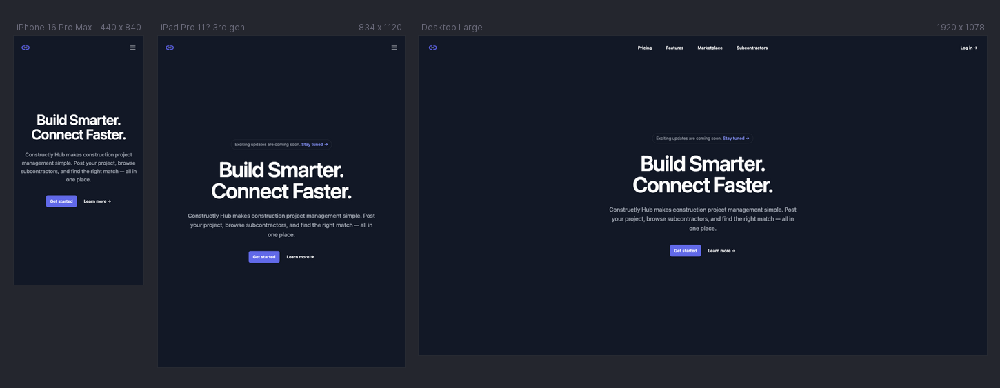
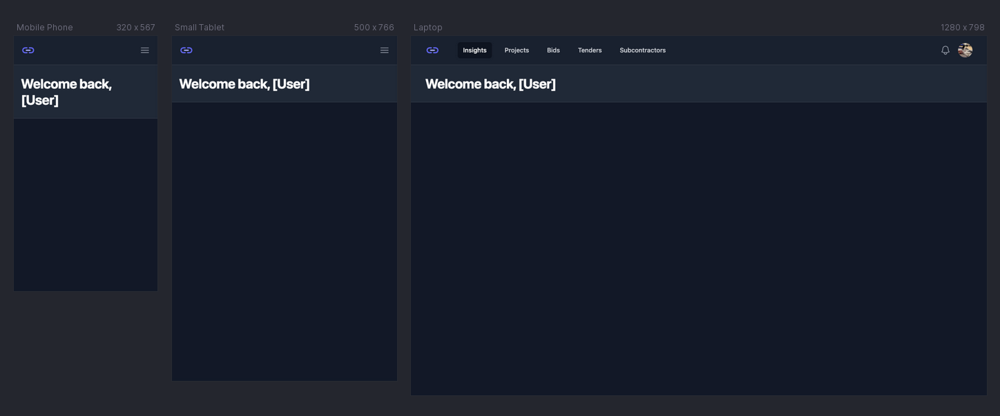
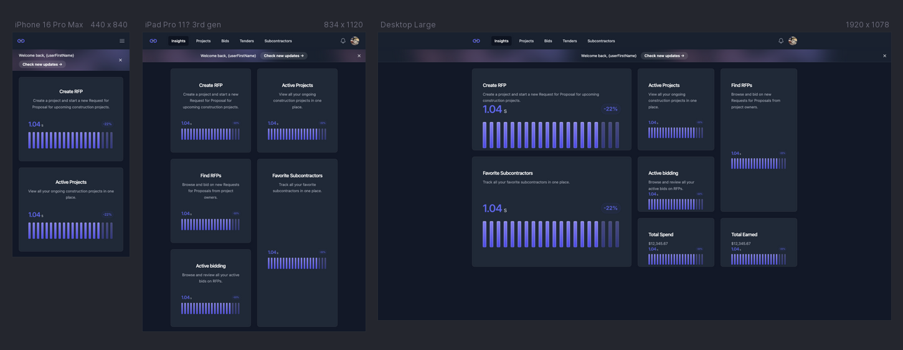
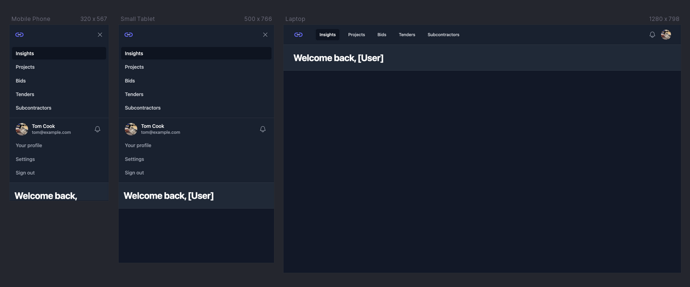
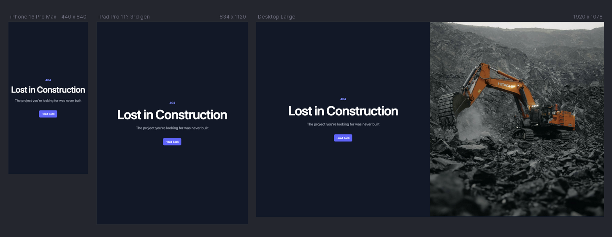

# Constructly Hub — A better way of Construction

Constructly Hub is a modern marketplace platform designed to simplify construction project management. Clients can post project requests, browse available subcontractors, and compare offers, while subcontractors can create profiles, showcase their expertise, and apply for relevant projects. The platform streamlines the entire process, making it easier for both sides to connect and collaborate effectively.

🔗 [**Live site**]()

---

## Contents

- [User Experience (UX)](#user-experience-ux)
  - [Business Goals](#business-goals)
  - [User Stories](#user-stories)
- [Design](#design)
  - [Color Scheme](#color-scheme)
  - [Typography](#typography)
  - [Imagery](#imagery)
  - [Wireframes](#wireframes)
- [Features](#features)
  - [Common to All Pages](#common-to-all-pages)
  - [Page-Specific Features](#page-specific-features)
  - [Future Implementations](#future-implementations)
  - [Accessibility Considerations](#accessibility-considerations)
- [Technologies Used](#technologies-used)
  - [Languages Used](#languages-used)
  - [Frameworks, Libraries & Programs Used](#frameworks-libraries--programs-used)
- [Deployment](#deployment)
- [Local Development](#local-development)
- [Testing](#testing)
- [Credits](#credits)
  - [Code Used](#code-used)
  - [Content](#content)
  - [Media](#media)
  - [Acknowledgments](#acknowledgments)

---

## User Experience (UX)

### Business Goals

### User Stories

## Design

### Color Scheme

### Typography

### Imagery

### Wireframes

See in PDF format **[Sitemap and User Flow Manifest](assets/documentation/flowcharts/logic/constructly-hub.pdf)**

<!-- Hero page -->

<!-- Main app layout -->

<!-- Insights -->

<!-- Main app dropdown -->

<!-- 404 Page -->

---

## Features

### Common to All Pages

### Page-Specific Features

<!-- **404 Page** -->
<!-- **401 Page** -->
<!-- **503 Page** -->

### Future Implementations

### Accessibility Considerations

<!-- - Semantic HTML: Meaningful HTML tags are used to ensure proper document structure for assistive technologies. -->
<!-- - Descriptive Alt Attributes: All images include descriptive alt attributes for screen reader users. -->
<!-- - Radio buttons are wrapped in fieldset with legend name. -->
<!-- - Color Contrast: Colors were selected to ensure sufficient contrast for readability. -->

---

## Technologies Used

### Languages Used

- **HTML**
- **CSS**
- **JavaScript**

### Frameworks, Libraries & Programs Used

- **[Git & GitHub](https://github.com/)** – Version control and hosting.
<!-- - **[Google Fonts](https://fonts.google.com/)** – Typography. -->
- **[Google DevTools](https://developer.chrome.com/docs/devtools/)** – Development & debugging.
- **[FigJam](https://www.figma.com/figjam/)** - Flowcharts
  <!-- - **[Font Awesome](https://fontawesome.com/)** – Icons via CDN. -->
  <!-- - **[FreeConvert](https://www.freeconvert.com/)** – Video compression. -->
  <!-- - **[Favicon.io](https://favicon.io/)** – Favicon generation. -->
- **[TinyPNG](https://tinypng.com/)** – Image optimization.
  <!-- - **[Polypane](https://polypane.app/)** – Responsive device previews. -->
  <!-- - **[Autoprefixer](https://autoprefixer.github.io/)** – Vendor prefixes for CSS. -->
  <!-- - **[ColorSpace](https://mycolor.space/)** – Palette generation. -->
  <!-- - **[HTML Validator](https://validator.w3.org/)** – Markup Validation Service. -->
  <!-- - **[CSS Validator](https://jigsaw.w3.org/css-validator/)** – CSS Validation Service. -->
  <!-- - **[WAVE](https://wave.webaim.org/)** – Web Accessibility Evaluation Tools. -->
  <!-- - **[JSLint](https://www.jslint.com/)** – JavaScript validation. -->
  <!-- - **[JSHint](https://jshint.com/)** – JavaScript validation. -->
- **[Tailwind CLI](https://tailwindcss.com/docs/installation/tailwind-cli)** – Tailwind CSS compiler.
- **[Jest](https://jestjs.io/)** – JavaScript testing framework.
- **[ESLint](https://eslint.org/)** – JavaScript linter for finding and fixing code issues, enforcing consistent style, and preventing bugs.
- **[Prettier](https://prettier.io/)** – Code formatter that ensures consistent style across your JavaScript, CSS, JSON, and other files.
- **[Husky](https://typicode.github.io/husky/)** – Git hooks made easy. Used to automatically run Prettier, ESLint, and tests before each commit.
- **[lint-staged](https://github.com/okonet/lint-staged)** – Runs linters or formatters only on staged files, making pre-commit hooks faster and more efficient.
  <!-- - **[Custom JS Lint API](https://luckyfrappe.github.io/jsapi/)** – JavaScript validation. -->
  <!-- - **[ChatGPT (OpenAI)](https://chat.openai.com/)** & **[Gemini (Google)](https://gemini.google.com/)** – Used for generating service descriptions, debugging support, exploring different approaches, and clarifying code concepts during development. -->

---

## Deployment

## Local Development

## Testing

See **[TESTING.md](TESTING.md)** for test cases, known issues, and resolved bugs.

---

## Credits

See **[Unicons](https://iconscout.com/contributors/unicons)** Company logo.

### Code Used

- **[Tailwind Plus UI Blocks](https://tailwindcss.com/plus)** – Tailwind Plus templates, built by the makers of Tailwind CSS.
<!-- https://medium.com/@bkn020612/using-eslint-husky-lint-staged-6d6609b02fc2  -->

### Content

### Media

- **[Image for 404 page](https://unsplash.com/id/foto/ekskavator-oranye-menggali-daerah-berbatu-RzwixD6C67s)** - View of excavator working at a excavation site.

### Acknowledgments
